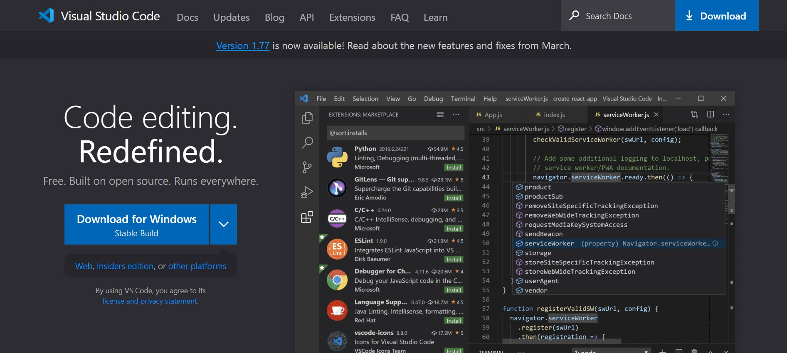
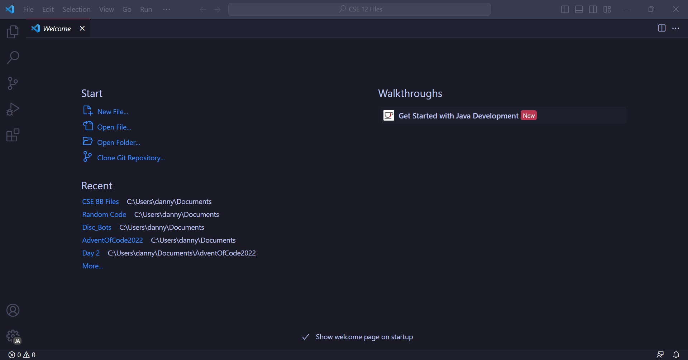

# Lab Report 1 - Remote Access and FileSystem 
Hello to anybody visiting this site! This is a general tutorial on the first steps for current, and future, students in the CSE 15L course offered at UCSD. In this guide, I will be going over the basics on setting up your coding environment to access your course-specific account on the ieng6 computers.  

## 1. Setting up your code environment
The first step that must be completed in order to access the servers is to fully setup your code environment. For this tutorial, I will be using Windows with Visual Studio Code as my editor and demonstrating how to setup the application, but most other editors should support these steps in someway as well.  

### Installing Visual Studio Code
To download the application onto your computer, search "VS Code" on your browser and press the first link that shows up, or just press 
[this link](https://code.visualstudio.com/). On the website, a page like the one shown below should appear.

> If you are using an operating system other than Windows, you can press the box to the right of the **Download for Windows** button with the down arrow to choose your specific operating system.

After clicking the download button, your browser should begin downloading the installer. With the installer finished, configure the installation settings to your preferences. Once the process is finished, the home page of VS Code should be displayed similar to the image below.

> The picture I included above may look different because of the themes I set and the features I have installed, but the general appearance should be very similar.

Congratulations! You are almost halfway done setting up the environment. The next step now is to install Git.
___

### Installing Git
With the code editor fully installed, you now have to download an additional software for your computer called Git. To get the software, you may search "Git download" on your browser and press the first link, or press [this link](https://git-scm.com/downloads). The link should take you to the website that looks similar to the image below.

