# Lab Report 1 - Remote Access and FileSystem

Hello to anybody visiting this site! This is a general tutorial on the first steps for current, and future, students in the CSE 15L course offered at UCSD. In this guide, I will be going over the basics on setting up your coding environment to access your course-specific account on the ieng6 computers.  

___

## 1. Setting up your code environment

The first step that must be completed in order to access the servers is to fully setup your code environment. For this tutorial, I will be using Windows with Visual Studio Code as my editor and demonstrating how to setup the application, but most other editors should support these steps in someway as well.  

### Installing Visual Studio Code

To download the application onto your computer, search "VS Code" on your browser and press the first link that shows up, or just press 
[this link](https://code.visualstudio.com/). On the website, a page like the one shown below should appear.

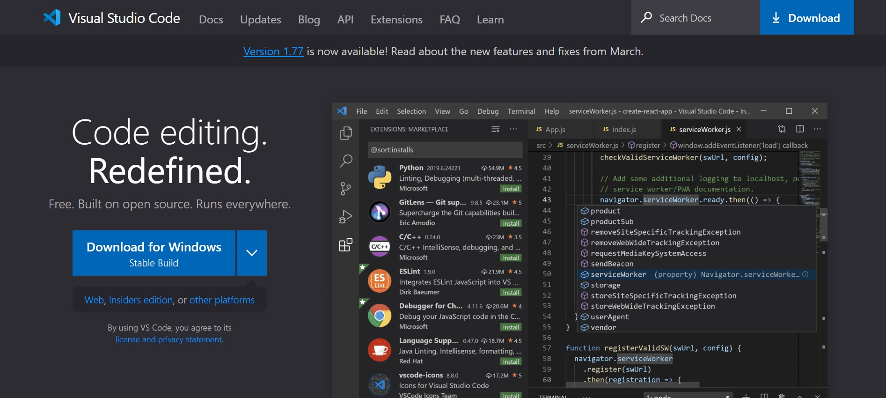

> If you are using an operating system other than Windows, you can press the box to the right of the **Download for Windows** button with the down arrow to choose your specific operating system.

After clicking the download button, your browser should begin downloading the installer. With the installer finished, configure the installation settings to your preferences. Once the process is finished, the home page of VS Code should be displayed similar to the image below.

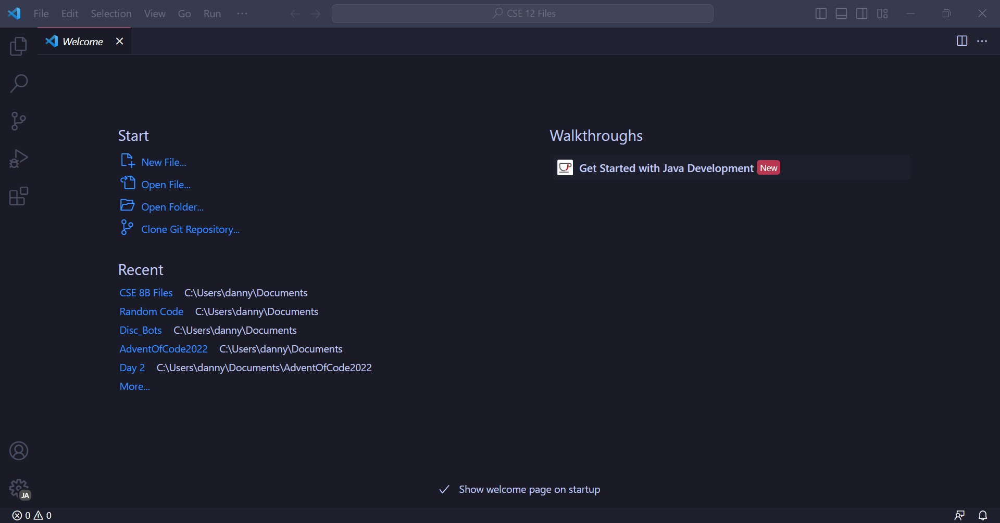

> The picture I included above may look different because of the themes I set and the features I have installed, but the general appearance should be very similar.

Congratulations! You are almost halfway done setting up the environment. The next step now is to install Git.

___

### Installing Git

With the code editor fully installed, you now have to download an additional software for your computer called Git. To get the software, you may search "Git download" on your browser and press the first link, or press [this link](https://git-scm.com/downloads). The link should take you to the website that looks similar to the image below.

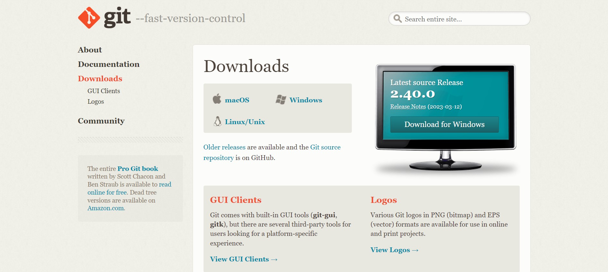

Once on this page, navigate to your operating system and select the installation that matches your preferences and computer. Go through the process while selecting your preferences, and you should be done installing Git. We're almost done setting up now!

___

### Setting Git Bash as your Default Terminal

> This step is not necessarily required, but the rest of this tutorial will follow instructions under the assumption that this step has been completed.

You will now be setting Git Bash as your default terminal on VS Code now that everything has been installed. To do this, go back to VS Code and press **Ctrl + Shift + P** to open a search bar. In that search bar, type in "Select Default Profile" and select "Git Bash". The process should look like the images below. 

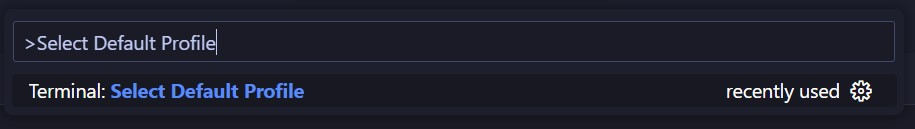

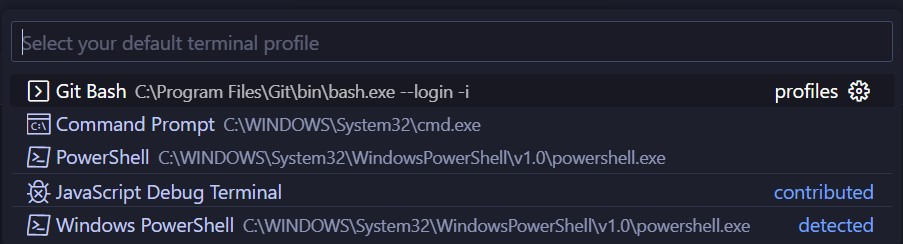

After that is finished, your coding environment is now fully ready!

___

## 2. Accessing the Remote Servers

With the setup ready, it's now time to login to the remote servers. 

### Getting your Course-specific Account

You will be logging into the remote server using your course-specific account on ieng6. To access your username and password, go to [this site](https://sdacs.ucsd.edu/~icc/index.php) and type in your Tritonlink username and PID into the respective boxes. 

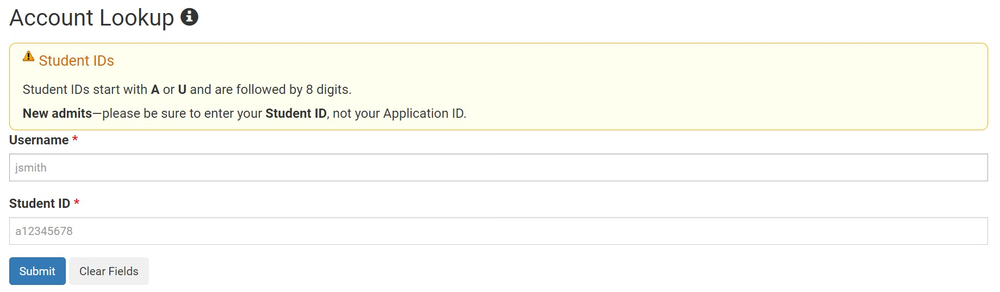

Once you have logged in, a new page should be shown with any additional course-specific accounts. Press the one that begins with "cs15l".

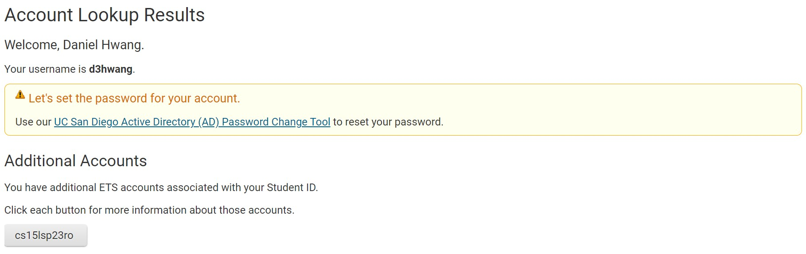

> The rest of the username after the "cs15l" will be your quarter season as well as your actual specific account name, which is why it will look different from mine.

On the new page that is opened, press the **Global Password Change Tool** link to begin setting your password. 

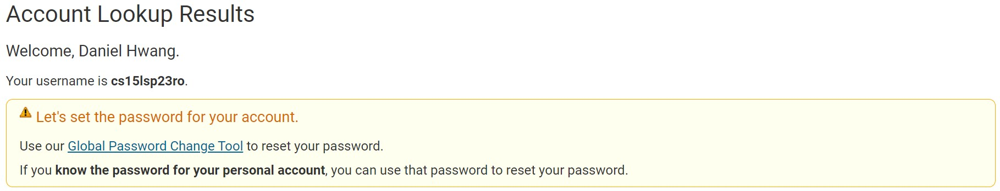

After that, press **Proceed to the Password Change Tool**.

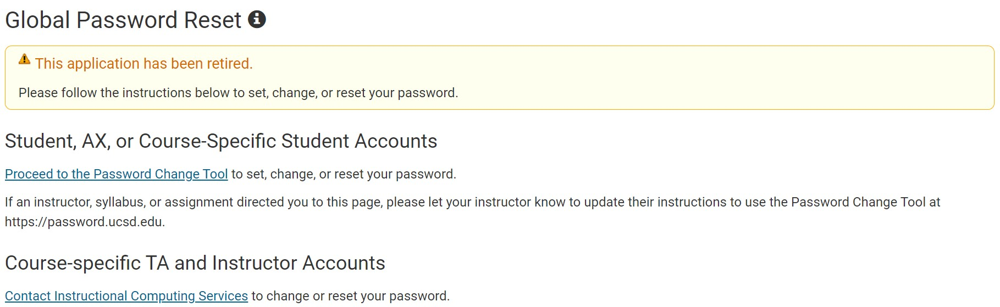

And finally, press **I want to reset my course-specific account password.** 

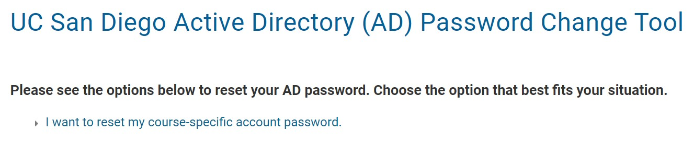

With the links fully navigated, you can now put in your course=specific username, login, and set your new password to use with the remote server.

___

### Logging into the Servers

Everything should now be properly setup! Now you can open a new terminal on VS Code using **Ctrl + \`**. A terminal should appear on the bottom of the screen with the word "bash" on the top right. Type in `ssh <username>@ieng6.ucsd.edu`and press **Enter**. It should now ask for your password, so type in the password you recently set for your account and press **Enter**.

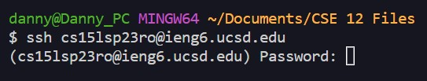

> The terminal will not show your password being typed in, but don't worry! This is normal and you may type it as normal.

> For whatever reason, if the ssh is not accepting your password, it is probably an issue with the student account. If you really want to experiment with the remote server but your account is not working, you may also use `ssh <tritonlink username>@ieng6.ucsd.edu` with your tritonlink password.

If everything went correctly, a large body of text should show up asking if you trust the server. Type in "yes" and press **Enter** one last time and you should be fully in the server now! 

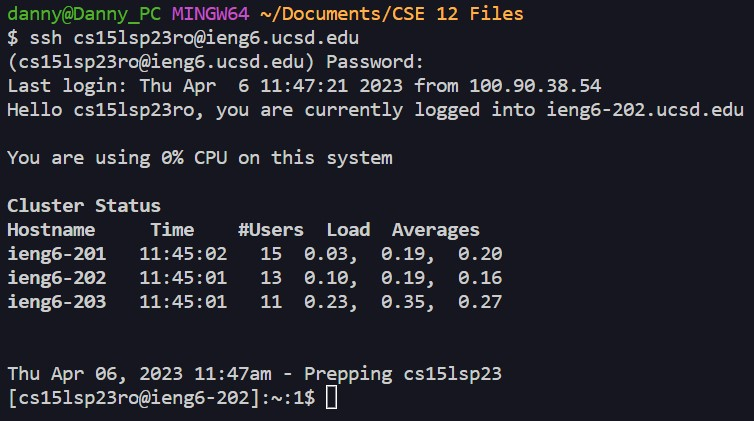

> Your terminal should look something like this now after logging in.

You're now done ssh-ing into the remote computer!

___

## 3. Experimenting with the Terminal

Now that you've logged into the server, you can mess around with some commands! Below is a list of commands that you can experiment with. Make sure that these commands do not cause any large or confusing errors.

* `cd~`
* `cd`
* `cd ..`
* `ls -lat`
* `ls -a`
* `pwd`

> If you want to check if something worked properly, then the command should either print something to the terminal or do nothing at all. It's okay if nothing seems to happen after using a command, sometimes that's a good thing.

___

### Logging Out

When you are finished using the remote computer, you may either use **Ctrl + d** or type `exit` to log out.

**Thanks for reading my tutorial on ssh-ing for the CSE 15L course offered at UCSD! I hope the instructions I provided were clear enough for anyone to follow along without issue. Good luck to anyone taking this course and have fun!**
