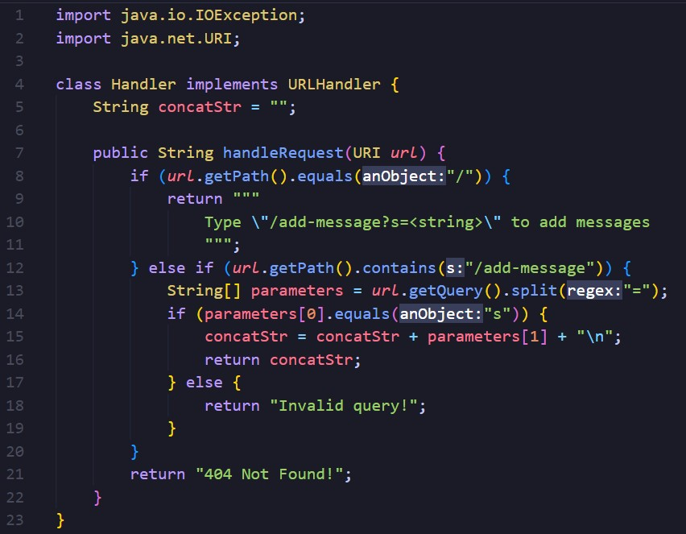
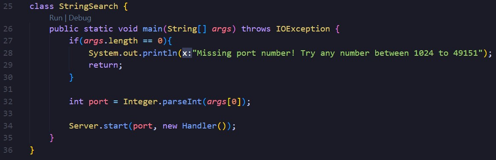
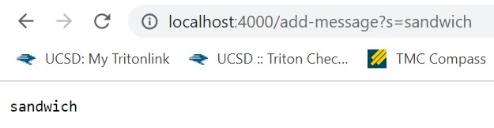
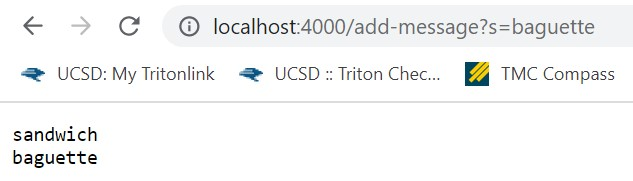
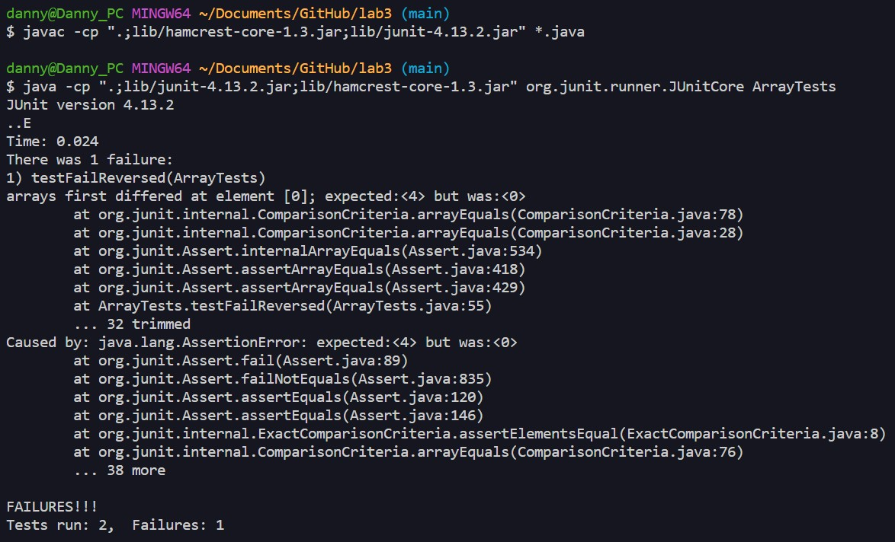

# Lab Report 2 - Servers and Bugs

## Part 1





> StringServer code



> First usage of add-message

* StringSearch's **main** method is called to start the server with a port of 4000. After the server is started, the **handleRequest** method from the Handler class is called to process the addition of the "add-message" path and query.
* The relevant field of the Handler class is **concatStr**. The concatStr field is the complete string that is formed when concatenating all added messages with a new line, which is then returned after each new added message. The relevant argument of the Handler class is **parameters**, which is given by the user's query in the URL. The parameters array is created by splitting the "s" with anything after the equals sign, concatenating the second element in parameters to concatStr. The relevant argument in the StringSearch class is **args**. The argument is given by the user in the command line, in which they input an integer value to use as the port of the server.
* The field **concatStr** was updated after using "add-message". This field was originally an empty string, but after calling the handleRequest method, concatStr is now the string "sandwich\n". With the query provided by the user, **parameters** is created to be {s, sandwich}. Lastly, **args** is an array equal to {4000}.



> Second usage of add-message

* The **handleRequest** method from the Handler class is called to process the new query of the "add-message" path.
* The relevant field of the Handler class is **concatStr**. The concatStr field is the complete string that is formed when concatenating all added messages with a new line, which is then returned after each new added message. The relevant argument of the Handler class is **parameters**, which is given by the user's query in the URL. The parameters array is created by splitting the "s" with anything after the equals sign, concatenating the second element in parameters to concatStr.
* The field **concatStr** was updated after using "add-message". This field was equal to "sandwich\n", but after calling the handleRequest method, concatStr is now the string "sandwich\nbaguette\n". With the query provided by the user, a new **parameters** array is created to be {s, baguette}. 

___

## Part 2

**ArrayExamples reversed method**

*Failure-inducing input*

```
@Test
public void testFailReversed() {
  int[] failInput = {1, 2, 3, 4};
  assertArrayEquals(new int[]{4, 3, 2, 1}, ArrayExamples.reversed(failInput);
}
```

*Passing input*

```
@Test
public void testPassReversed() {
  int[] passInput = {};
  assertArrayEquals(new int[]{}, ArrayExamples.reversed(passInput);
}
```

*Screenshot of the output of running both tests*



*Code before fix*

```
static int[] reversed(int[] arr) {
  int[] newArray = new int[arr.length];
  for(int i = 0; i < arr.length; i += 1) {
    arr[i] = newArray[arr.length - i - 1];
  }
  return arr;
}
```

*Code after fix*

```
static int[] reversed(int[] arr) {
  int[] newArray = new int[arr.length];
  for(int i = 0; i < arr.length; i += 1) {
    newArray[i] = arr[arr.length - i - 1];
  }
  return newArray;
}
```

The issue with the original code was that it would update the original array instead of the new array, causing the array to lose the latter half of its elements. Because the code reflects the array, the second half would not be able to be a reflection of the first half because the first half would already have been changed. To fix this, we update the new array so none of the original values are changed, then return the new array.
