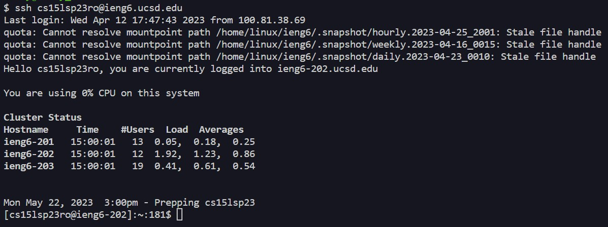
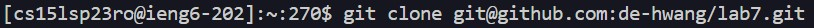
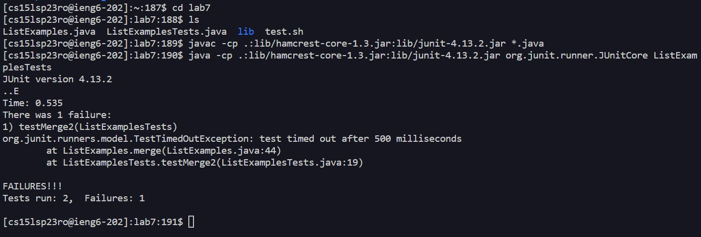
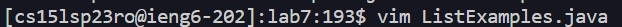
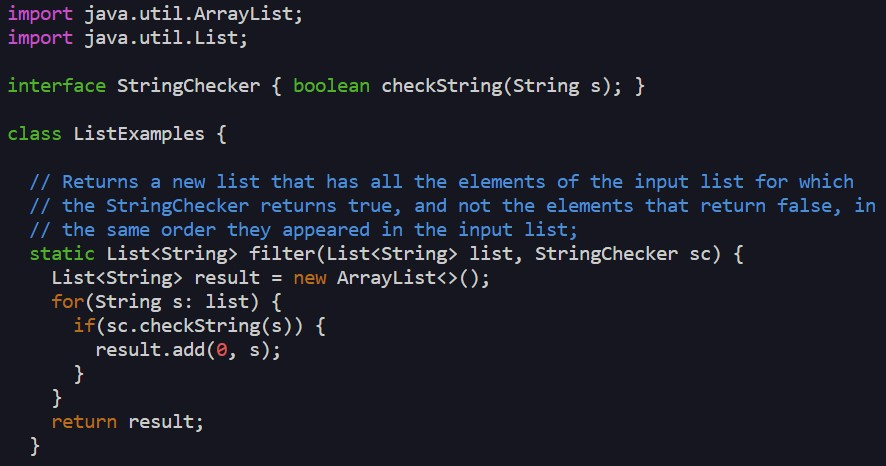
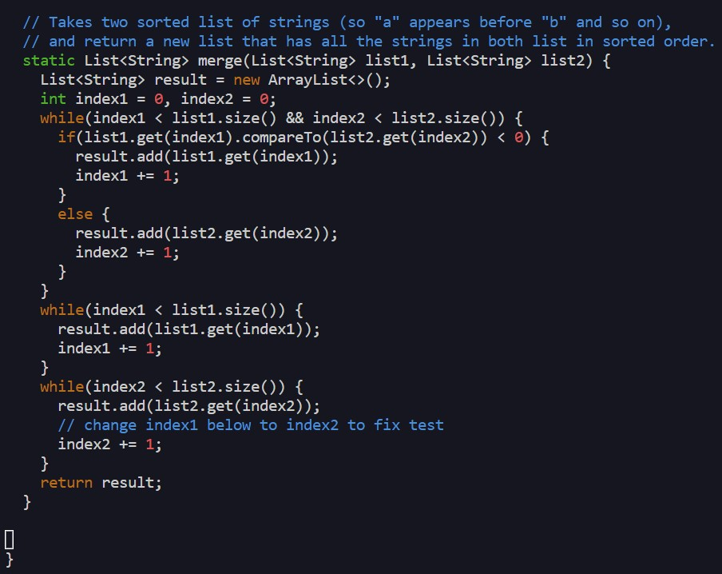
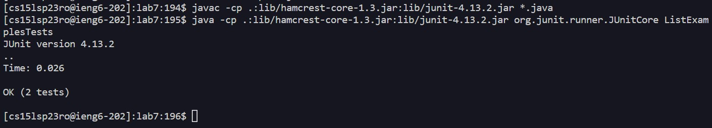
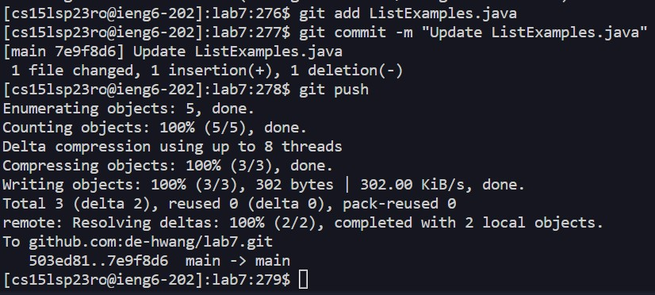

# Lab Report 4 - Doing it All from the Command Line

## Step 4

Keys pressed: `ssh cs15lsp23ro@ieng6.ucsd.edu <enter>`

To begin the tasks, I had to first login to the ieng6 machines.

___

## Step 5

Keys pressed: `git clone <Ctrl + v> <enter>`

I copied the ssh key to my repository and pasted the key in my terminal to make a clone of the fork.

___

## Step 6

Keys pressed: `cd lab7 <enter>`, `ls <enter>`, `<Ctrl + v> <enter>`, `<Ctrl + v> ListExamplesTests <enter>`

I first cd'ed into the cloned directory and made sure I knew what the file names were. Then, I copied `javac -cp .:lib/hamcrest-core-1.3.jar:lib/junit-4.13.2.jar *.java` and pasted it into the terminal to compile the tester. Finally, I copied `java -cp .:lib/hamcrest-core-1.3.jar:lib/junit-4.13.2.jar org.junit.runner.JUnitCore` and pasted it into the terminal along with the name of the tester file, **ListExamplesTests**, to run the tests.

___

## Step 7

Keys pressed: `vim ListExamples.java <enter>`, `/index1 <enter>`, `n n n n`, `l l l l l`, `r`, `2 <enter>`, `:wq`

To edit the file, I opened **ListExamples.java** on vim. Then, to search for the error, I searched for the phrase "index1" and cycled through 4 of the found instances until I landed on the error. From there, I moved to the right 5 times and replaced the "1" to a "2", therefore changing it to "index2". After that, I saved and exited the file.

___

## Step 8

Keys pressed: `<up> <up> <up> <enter>`, `<up> <up> <up> <enter>`

The `javac -cp .:lib/hamcrest-core-1.3.jar:lib/junit-4.13.2.jar *.java` command was three lines up, so I used the `<up>` key to reuse it. Then, the `java -cp .:lib/hamcrest-core-1.3.jar:lib/junit-4.13.2.jar org.junit.runner.JUnitCore ListExamplesTests` line was also three lines up, so I used the `<up>` key to reuse it.
  
___
  
## Step 9

Keys pressed: `git add ListExamples.java <enter>`, `git commit -m "Update ListExamples.java" <enter>`, `git push <enter>`

I first added the updated file to the stage using `git add`, and then created the commit message using `git commit`. Lastly, I used `git push` to push the committed change to the repository.
