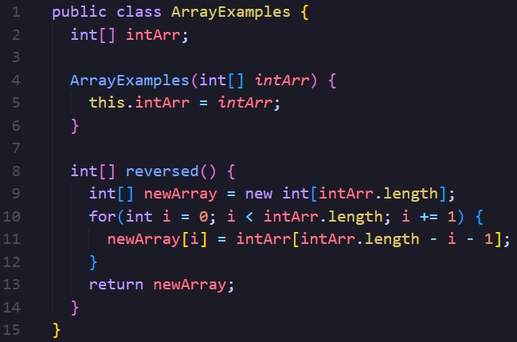
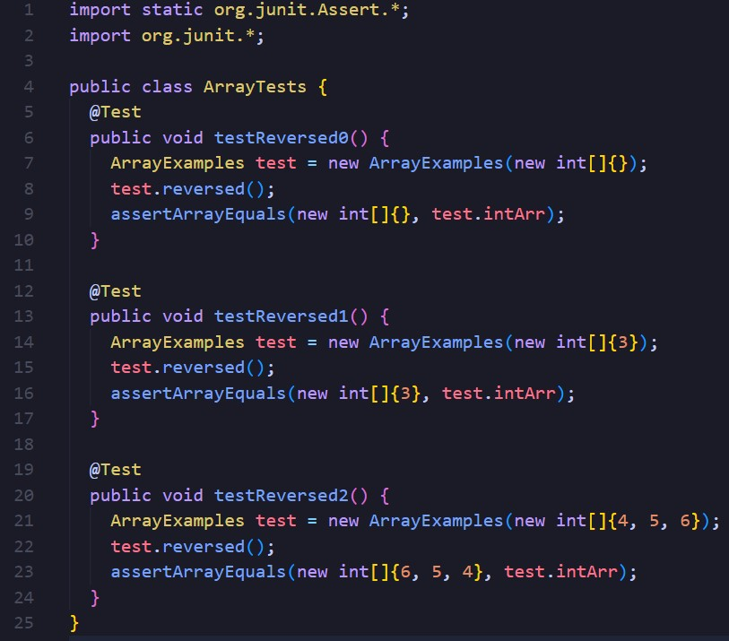
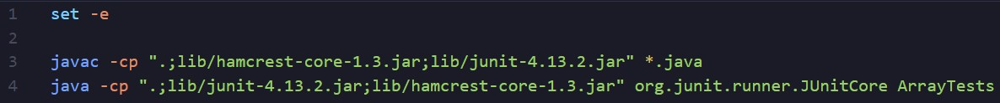
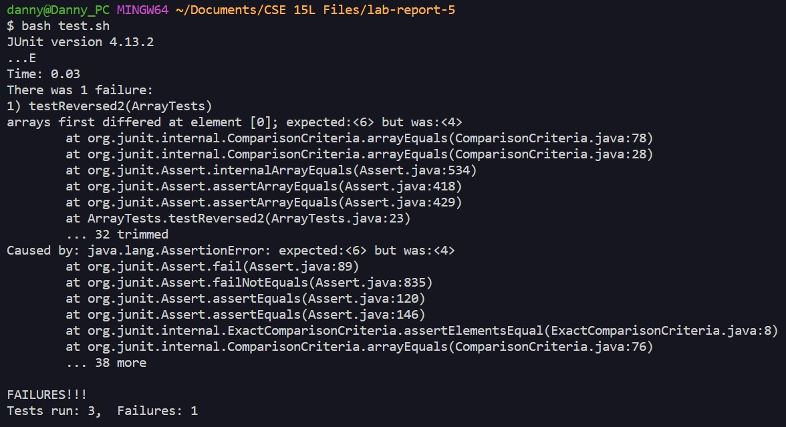
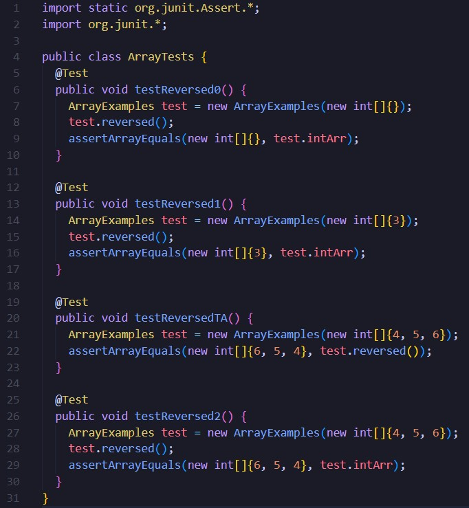
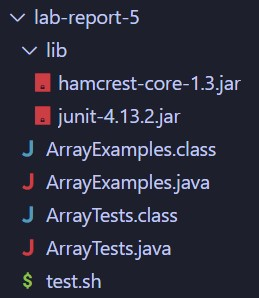

# Lab Report 5 - Debugging and Reflection

## Part 1 - Debugging Scenario

### 1.
**What environment are you using (computer, operating system, web browser, terminal/editor, and so on)?**

I am using a Windows laptop and working on VS code. I am trying to run my code on my local computer.

**Detail the symptom you're seeing. Be specific; include both what you're seeing and what you expected to see instead. Screenshots are great, copy-pasted terminal output is also great. Avoid saying “it doesn't work”.**

ArrayExamples.java:

ArrayTests.java: 

test.sh: 

I am trying to make a method that takes in an int array from a constructor and reverses the array. It seems to work fine for an array with a length of 0 or 1, so I assume that there is not any errors in indexing, but JUnit seems to fail the test when given an array with more than one element. From what I can assume, it seems like my code is having trouble updating the left side of the array?

**Detail the failure-inducing input and context. That might mean any or all of the command you're running, a test case, command-line arguments, working directory, even the last few commands you ran. Do your best to provide as much context as you can.**

For the constructor, I am trying to put an array of `{4, 5, 6}` as my argument. However, this causes an error with my `testReversed2()` method, as it seems to not be reversing. I am properly cd'ed into the right directory, so I have no problems actually accessing all of my files. I am using a bash script to compile and run the files, but there seems to be no error there either.

___

### 2.

It seems like your `reversed()` method returns an array. Try checking if `reversed()` returns `new int[]{6, 5, 4}` instead of just the instance variable.

___

### 3.
Added test:

I tried checking what gets returned with a JUnit test, and the method itself properly reverses the array. The problem was that I made a temporary array, but forgot to set the instance variable array equal to the reversed temporary array. Thank you for the help!

___

### 4.
File and directory structure:

Contents before fix:

ArrayExamples.java:

ArrayTests.java: 

test.sh: 

Command to trigger the bug:

`$ bash test.sh`

Description of fix:

The variable `intArr` should be assigned to `newArray`, so that the instance variable is updated accordingly. Before the return statement, `intArr = newArray;` should be added, and then `intArr` should be returned to ensure everything worked properly.

___

## Part 2 - Reflection

In the second half of this quarter, being able to get hands-on experience working with bash scripts has really helped me understand how versatile and useful they really are. I knew that programs could be scripted, but I did not know that the actual scripting can contain its own code. For example, trying to make a grading script was really fun as I tried to automate a process that would have taken me multiple terminal lines. Although the syntax feels strange, I want to find more ways to use bash scripts and different commands that would allow me to automate more tasks.
